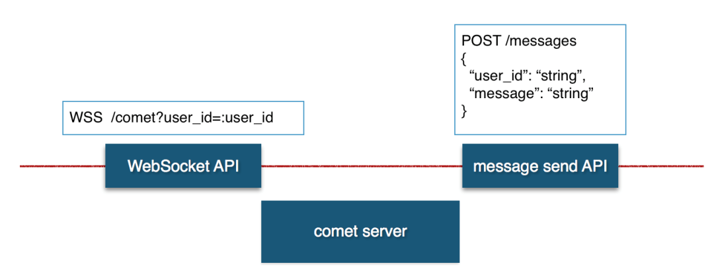
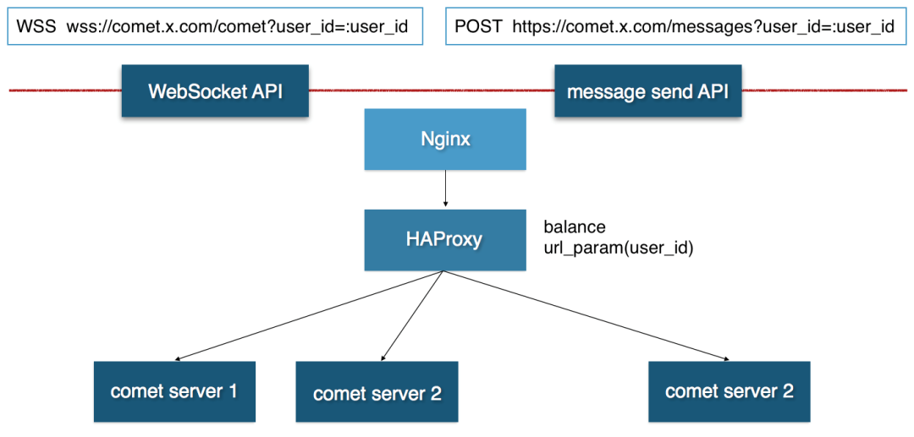

## Golang 使用 WebSocket 构建高并发推送服务
1 场景介绍

Web 应用中，常有业务状态需要实时更新的场景。如一个较长的后台任务，从浏览器用户触发执行到执行完成可能需几十秒的时间，这时前端需隔几秒请求一次后台，查询任务执行进度。此种方式是长轮询的方式，是存在一定弊端的，增加了后台服务的负载，若并发操作量太大，后台压力会成倍激增。业界常采用 http1.1 的 Websocket 扩展协议与浏览器建立长连接来实现实时业务状态更新。

2 实现方案

本文采用 Golang 实现一个长连接服务，对外提供两个接口，一个是基于 HTTP 的 REST 消息发送接口，一个是基于 Websocket 的 Client 接入接口，如下图所示。

Image
为使前端的接入更简单，从建立连接到用户关闭浏览器，中间前端无须发送消息来告知服务器 Client 是否下线。我们将检测放在后台，后台采用定时心跳方式保持对 Client 的监听，若心跳失败，则将该 Client 剔除。如下图所示。

Image
3 Golang 实现代码
Comet 服务内有两个模块，HTTP Server 负责接收消息，Comet Server 负责维护 Websocket Client，每个 Client 启用一个 go routine 对客户端保持心跳检测。

3.1 核心模块

```python 
package comet

import (
    "encoding/json"
    "log"
    "time"

    "golang.org/x/net/websocket"
)

type HttpServer struct {
    wsServer *WsServer
}

type WsServer struct {
    Clients map[string][]*Client
    AddCli  chan *Client
    DelCli  chan *Client
    Message chan *Message
}

type Client struct {
    UserId    string
    Timestamp int64
    conn      *websocket.Conn
    wsServer  *WsServer
}

type Message struct {
    UserId  string `json:"user_id"`
    Message string `json:"message"`
}

func NewWsServer() *WsServer {
    return &WsServer{
        make(map[string][]*Client),
        make(chan *Client),
        make(chan *Client),
        make(chan *Message, 1000),
    }
}

func NewHttpServer(wsServer *WsServer) *HttpServer {
    return &HttpServer{wsServer}
}

func (httpServer *HttpServer) SendMessage(userId, message string) {
    log.Printf("message reveived, user_id: %s, message: %s", userId, message)
    httpServer.wsServer.Message <- &Message{userId, message}
}

func (wsServer *WsServer) SendMessage(userId, message string) {
    clients := wsServer.Clients[userId]
    if len(clients) > 0 {
        for _, c := range clients {
            c.conn.Write([]byte(message))
        }
        log.Printf("message success sent to client, user_id: %s", userId)
    } else {
        log.Printf("client not found, user_id: %s", userId)
    }
}

func (wsServer *WsServer) addClient(c *Client) {
    clients := wsServer.Clients[c.UserId]
    wsServer.Clients[c.UserId] = append(clients, c)
    log.Printf("a client added, userId: %s, timestamp: %d", c.UserId, c.Timestamp)
}

func (wsServer *WsServer) delClient(c *Client) {
    clients := wsServer.Clients[c.UserId]
    if len(clients) > 0 {
        for i, client := range clients {
            if client.Timestamp == c.Timestamp {
                wsServer.Clients[c.UserId] = append(clients[:i], clients[i+1:]...)
                break
            }
        }
    }
    if 0 == len(clients) {
        delete(wsServer.Clients, c.UserId)
    }
    log.Printf("a client deleted, user_id: %s, timestamp: %d", c.UserId, c.Timestamp)
}

func (wsServer *WsServer) Start() {
    for {
        select {
        case msg := <-wsServer.Message:
            wsServer.SendMessage(msg.UserId, msg.Message)
        case c := <-wsServer.AddCli:
            wsServer.addClient(c)
        case c := <-wsServer.DelCli:
            wsServer.delClient(c)

        }
    }
}

func (c *Client) heartbeat() error {
    millis := time.Now().UnixNano() / 1000000
    heartbeat := struct {
        Heartbeat int64 `json:"heartbeat"`
    }{millis}
    bytes, _ := json.Marshal(heartbeat)
    _, err := c.conn.Write(bytes)
    return err
}

func (c *Client) Listen() {
    for {
        err := c.heartbeat()
        if nil != err {
            log.Printf("client heartbeat error, user_id: %v, timestamp: %d, err: %s", c.UserId, c.Timestamp, err)
            c.wsServer.DelCli <- c
            return
        }
        time.Sleep(time.Second * 5)
    }
}
``` 

3.2 完整代码
https://github.com/olzhy/comet

4 一致性哈希包装

考虑到单服务的同时在线人数支持是有限的，所以在其上层用一致性哈希算法包装。这样同一 user_id 建立连接会打到同一台后台服务器，给此 user_id 发送消息也会打到同样的服务器。这样后台部署多个 Comet 服务形成一个集群即可支撑高并发消息推送场景。如下图所示，最外层 Nginx 挂接公网域名，对外提供基于 wss 的消息接收接口及基于 http 的消息发送接口。中间采用 HAProxy 对 user_id 参数作一致性哈希转发，对同一 user_id 的操作会打到同一台 Comet Server。底层扩展为多台 Comet Server 即可构建一个高并发的消息推送服务。

Image
