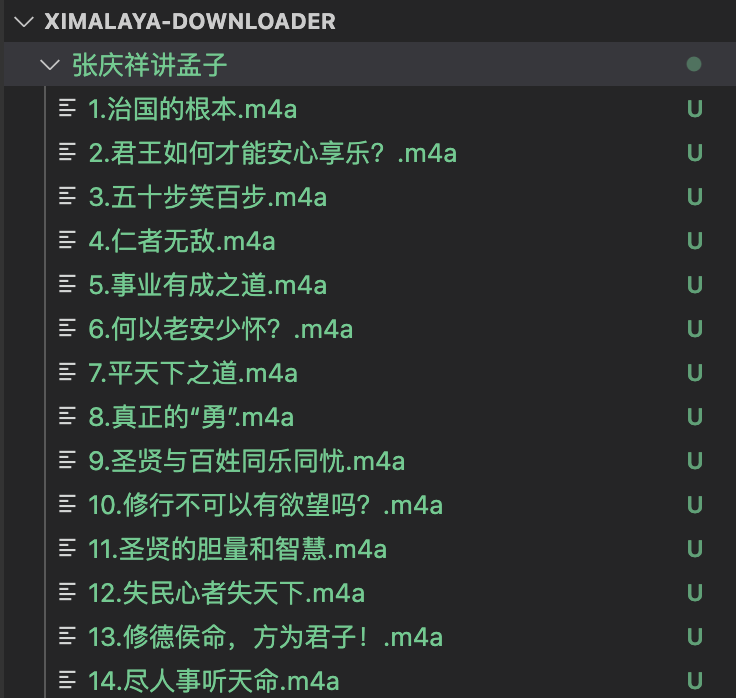
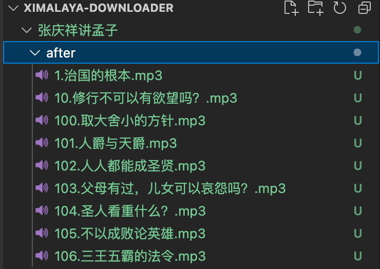

## 使用 Golang 实现喜马拉雅音频下载


「喜马拉雅」是本人非常喜欢的一款音频软件。里面有很多优质的音频节目，丰富了我的日常生活。

本文的诞生来自于我的个人需求：本人是喜马拉雅 APP 的重度用户，几乎每天都会使用其来听一些经典，它的确是给了我「每一天的精神食粮」。有时，有一些音频想下载下来反复听，但受限于手机的存储容量，不能随心将想听的音频进行下载。因此，便萌生了写点代码将音频下载到 U 盘，电脑或 MP3 设备的想法。

需要特别说明的是：本程序不涉及登录，不涉及付费内容盗取，下载的是喜马拉雅网站免登录状态下完全公开的内容。

接下来便依序介绍从 API 调研到 Golang 代码实现，以及如何使用及如何进行音频格式转换的整个过程。

1 API 调研
专辑 ID 如何获取？
要获取一个专辑（Album）下所有的音频，必须要知道专辑的 ID。

如下图所示，访问喜马拉雅的某个专辑时，从浏览器地址栏可以看到该专辑的 ID（本例中，248003 就是「张庆祥讲孟子」专辑的 ID）。

Image


获取音频的 API
写作本文时，喜马拉雅网站：

根据专辑 ID 分页获取音频列表的 API 为：https://www.ximalaya.com/revision/album/v1/getTracksList?albumId=:albumId&pageNum=:pageNum

根据音频 ID 获取音频下载链接的 API 为：https://www.ximalaya.com/revision/play/v1/audio?id=:trackId&ptype=1

这样，有了专辑 ID，就可以根据上面第一个 API 查询到其下的所有音频详情（包括音频 ID、音频标题等）；有了音频 ID，就可以根据第二个 API 查询到音频地址，然后进行下载了。

2 Golang 实现
实现音频下载的 Golang 代码已托管至本人 GitHub - github.com/olzhy/ximalaya-downloader。

因实现逻辑简单，整个实现的代码也不到 200 行，下面只看一下 main 函数的逻辑。

```python

package main 

func main() {
    // parameter validation
    if len(os.Args) < 2 {
        fmt.Println("please provide an album id")
        return
    }
    albumId, err := strconv.Atoi(os.Args[1])
    if err != nil {
        fmt.Println("album id should be an integer")
        return
    }
    fmt.Printf("album id: %d\n", albumId)

    // get all track list
    tracks, err := getAllTrackList(albumId)
    if err != nil {
        fmt.Printf("error in get all track list, err: %v\n", err)
        return
    }
    fmt.Printf("all track list got, total: %d\n", len(tracks))

    // get audio addresses
    for _, track := range tracks {
        audioAddr, err := getAudioAddress(track.TrackId)
        if err != nil {
            fmt.Printf("error in get audio address, err: %v\n", err)
            break
        }

        // download
        filePath, err := download(audioAddr, track.Title, track.AlbumTitle)
        if err != nil {
            fmt.Printf("error in audo download, err: %v\n", err)
            continue
        }
        fmt.Printf("downloaded! file: %s\n", filePath)
    }
}
```
可以看到，在main函数中：

首先作了参数校验（必须提供一个专辑 ID）；
调用 getAllTrackList 函数获取指定专辑下的所有 tracks（每个 track 中有音频 ID、标题等信息）；
遍历 tracks 数组，对每个 track，调用 getAudioAddress 函数获取音频地址，然后进行下载。
3 如何使用？
使用起来非常简单，拥有 Go 运行环境的话，指定专辑 ID 直接运行main.go即可。示例如下：
```
go run main.go 248003

album id: 248003
all track list got, total: 140
downloaded! file: 张庆祥讲孟子/1.治国的根本.m4a
downloaded! file: 张庆祥讲孟子/2.君王如何才能安心享乐？.m4a
downloaded! file: 张庆祥讲孟子/3.五十步笑百步.m4a
downloaded! file: 张庆祥讲孟子/4.仁者无敌.m4a
...
```
程序会在当前运行命令的文件夹下新建一个以该专辑命名的文件夹，并将该专辑下所有的音频逐条下载至该专辑文件夹下。下载结果如下图所示：

Image


4 m4a 如何转 mp3？
下载完成后还有一个问题，就是喜马拉雅的音频格式为.m4a，该格式在苹果设备上播放没有问题，但其它设备的默认音频播放器不支持播放该种格式。

怎么办呢？我们可以借助工具将其转换为更加通用的mp3格式。

最简单直观的方式是搜索在线 m4a 到 mp3 转换工具（如 freeconvert.com/m4a-to-mp3），在网页上传文件并等待转换完成后进行下载即可。

但作为程序员，本人更喜欢使用命令的方式进行转换。下面会介绍一个小工具 - FFmpeg，使用其即可进行 m4a 到 mp3 的音频转换。

首先到「FFmpeg 下载页」找到与您当前操作系统匹配的可执行文件下载链接（本人使用的是 Mac，找到的下载链接为 evermeet.cx/ffmpeg），然后使用如下命令对压缩包下载、解压并将解压后的可执行文件ffmpeg移动至/usr/local/bin：
```
curl -O https://evermeet.cx/ffmpeg/ffmpeg-109029-g1800a0da09.zip
unzip ffmpeg-109029-g1800a0da09.zip
sudo mv ffmpeg /usr/local/bin
```
安装好了ffmpeg，即可使用如下命令对m4a文件进行转换了：
```
cd 张庆祥讲孟子/
mkdir after
for f in *.m4a; do ffmpeg -i "$f" -codec:v copy -codec:a libmp3lame -q:a 2 after/"${f%.m4a}.mp3"; done
```
如上命令首先进入待转换的m4a音频文件所在文件夹，然后创建转换后的文件存储文件夹after，最后对所有的m4a文件使用ffmpeg将其转换为mp3格式并放至文件夹after。转换后的结果如下图所示：

Image

有了这些更通用的 mp3 格式，即可在离线情况下在几乎任何可以播放音频的设备上随心去听这些音频了。

综上，本文介绍了如何使用 Golang 实现喜马拉雅音频下载及 m4a 到 mp3 的格式转换方法。总结一下，主要作自己使用，也希望对感兴趣的同学有所帮助。

参考资料

[1] 喜马拉雅 - ximalaya.com

[2] FFmpeg - ffmpeg.org

[3] FFMPEG: Convert m4a to mp3 without significant loss - superuser.com